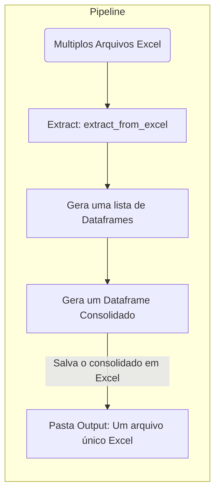

# Welcome to MkDocs

For full documentation visit [mkdocs.org](https://www.mkdocs.org).

## Workflow

# Função de transformação de dados
### ::: src.infrastructure.data.pipeline.extract.extract_from_excel
